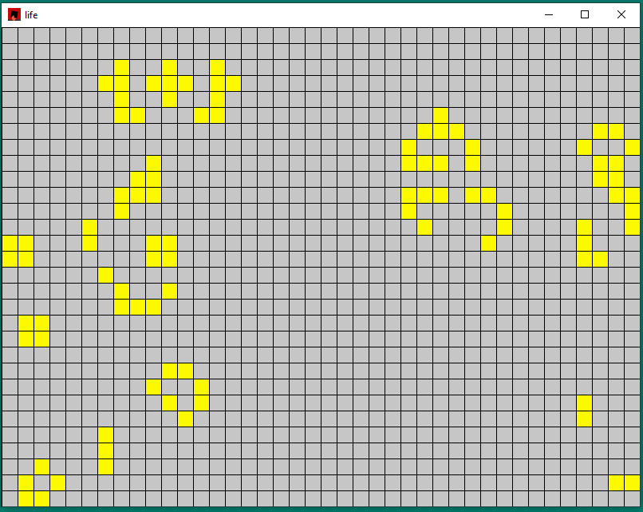

# game_of_life_rs

A simple implementation of Conway's Game of Life in Rust.

## [Overview](https://en.wikipedia.org/wiki/Conway%27s_Game_of_Life)

Conway's Game of Life is a cellular automaton created by the mathematician John Conway.
The game consists of a grid of cells, each of which can be in one of two states: alive or dead.
The state of the cells evolves based on simple rules.
- Rules
  - Any live cell with fewer than two live neighbors dies.
  - Any live cell with two or three live neighbors lives on to the next generation.
  - Any live cell with more than three live neighbors dies.
  - Any dead cell with exactly three live neighbors becomes a live cell.

## Features

- **Customizable Board:** Specify the width and height of the game board, allowing for different grid sizes.
  
- **Random Initialization:** Initialize the board with a random configuration or use predefined patterns like the glider gun.

- **Interactive Controls:** 
  - **F1:** Randomize Board - Resets the board with a random configuration.
  - **F2:** Toggle Auto-Play - Starts or stops the automatic progression of generations.
  - **F3:** Glider Gun - Initializes the board with the famous glider gun pattern.
  - **F4:** Manual Step - Advances the simulation by one generation when auto-play is disabled.


- **Visualization:** Visualize the evolving generations of cells with a simple graphical representation using macroquad. (More visualizations will be added when this is separated into a library)

## Example
 - Macroquad visualization<br>
</img>

## Getting Started

### Prerequisites

- [Install Rust](https://www.rust-lang.org/learn/get-started)

### Building and Running

1. Clone the repository (or download through github):

    ```bash
    git clone https://github.com/Andrewtopnacho/game_of_life_rs.git
    ```

2. Navigate to the repository directory

    ```bash
    cd game_of_life_rs
    ```

3. Build and run the project:

    ```bash
    cargo run
    ```

## Acknowledgments

- [Conway's Game of Life](https://en.wikipedia.org/wiki/Conway%27s_Game_of_Life) - Learn more about the fascinating world of cellular automata.

- [macroquad](https://github.com/not-fl3/macroquad) - Simple and easy-to-use game development framework for Rust.
